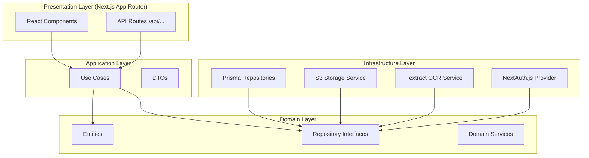
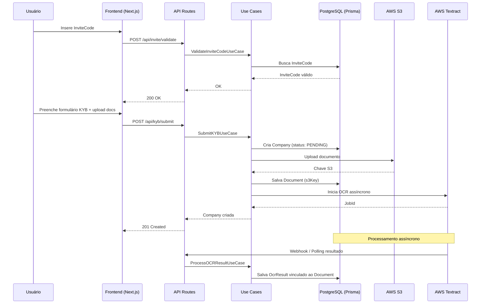

# Documento de Design — Plataforma de Onboarding KYC/KYB

## Visão Geral

A plataforma de Onboarding KYC/KYB é uma aplicação web construída com **Next.js App Router** e **TypeScript**, seguindo os princípios da **Clean Architecture**. Ela permite que empresas e seus sócios/representantes realizem o processo de cadastro e validação de identidade de forma guiada, com extração automática de dados via OCR, painel administrativo para gestão e aprovação, e suporte a personalização visual via sistema White-Label.

### Objetivos Técnicos

- Separação clara de responsabilidades via Clean Architecture (Domain → Application → Infrastructure → Presentation)
- Schema de banco de dados relacional robusto via Prisma ORM + PostgreSQL
- Armazenamento seguro de documentos no AWS S3 com presigned URLs
- Extração automática de dados via AWS Textract
- Sistema White-Label baseado em variáveis CSS nativas + Tailwind CSS
- Controle de acesso por Invite Code e autenticação baseada em roles
- Infraestrutura containerizada com Docker e Docker Compose

---

## Arquitetura

A aplicação segue a **Clean Architecture** com quatro camadas bem definidas:

```
src/
├── domain/           # Entidades, interfaces de repositório, regras de negócio puras
├── application/      # Casos de uso, DTOs, serviços de aplicação
├── infrastructure/   # Implementações concretas (Prisma, S3, Textract, Auth)
└── presentation/     # App Router do Next.js (pages, components, API routes)
```

### Diagrama de Arquitetura em Camadas



### Fluxo de Dados Principal



---

## Estrutura de Pastas

```
kyc-kyb-onboarding-platform/
├── src/
│   ├── domain/
│   │   ├── entities/
│   │   │   ├── User.ts
│   │   │   ├── Company.ts
│   │   │   ├── Partner.ts
│   │   │   ├── Document.ts
│   │   │   ├── InviteCode.ts
│   │   │   └── ThemeConfig.ts
│   │   ├── repositories/
│   │   │   ├── IUserRepository.ts
│   │   │   ├── ICompanyRepository.ts
│   │   │   ├── IPartnerRepository.ts
│   │   │   ├── IDocumentRepository.ts
│   │   │   ├── IInviteCodeRepository.ts
│   │   │   └── IThemeConfigRepository.ts
│   │   └── services/
│   │       ├── ICNPJValidator.ts
│   │       ├── ICPFValidator.ts
│   │       └── IStorageService.ts
│   │
│   ├── application/
│   │   ├── use-cases/
│   │   │   ├── invite/
│   │   │   │   ├── GenerateInviteCodeUseCase.ts
│   │   │   │   └── ValidateInviteCodeUseCase.ts
│   │   │   ├── kyb/
│   │   │   │   └── SubmitKYBUseCase.ts
│   │   │   ├── kyc/
│   │   │   │   └── SubmitKYCPartnerUseCase.ts
│   │   │   ├── admin/
│   │   │   │   ├── UpdateOnboardingStatusUseCase.ts
│   │   │   │   └── ListCompaniesUseCase.ts
│   │   │   ├── ocr/
│   │   │   │   └── ProcessOCRResultUseCase.ts
│   │   │   └── theme/
│   │   │       └── GetThemeConfigUseCase.ts
│   │   └── dtos/
│   │       ├── KYBSubmitDTO.ts
│   │       ├── KYCPartnerDTO.ts
│   │       └── ThemeConfigDTO.ts
│   │
│   ├── infrastructure/
│   │   ├── database/
│   │   │   ├── prisma/
│   │   │   │   └── schema.prisma
│   │   │   └── repositories/
│   │   │       ├── PrismaUserRepository.ts
│   │   │       ├── PrismaCompanyRepository.ts
│   │   │       ├── PrismaPartnerRepository.ts
│   │   │       ├── PrismaDocumentRepository.ts
│   │   │       ├── PrismaInviteCodeRepository.ts
│   │   │       └── PrismaThemeConfigRepository.ts
│   │   ├── storage/
│   │   │   └── S3StorageService.ts
│   │   ├── ocr/
│   │   │   └── TextractOCRService.ts
│   │   └── auth/
│   │       └── nextauth.config.ts
│   │
│   └── presentation/
│       ├── app/
│       │   ├── layout.tsx
│       │   ├── page.tsx
│       │   ├── (auth)/
│       │   │   ├── login/page.tsx
│       │   │   └── register/page.tsx
│       │   ├── onboarding/
│       │   │   ├── invite/page.tsx
│       │   │   ├── kyb/page.tsx
│       │   │   └── kyc/page.tsx
│       │   └── admin/
│       │       ├── layout.tsx
│       │       ├── page.tsx
│       │       ├── companies/[id]/page.tsx
│       │       └── invite-codes/page.tsx
│       ├── components/
│       │   ├── ui/
│       │   ├── forms/
│       │   │   ├── InviteCodeForm.tsx
│       │   │   ├── KYBForm.tsx
│       │   │   └── KYCPartnerForm.tsx
│       │   └── admin/
│       │       ├── CompanyList.tsx
│       │       ├── CompanyDetail.tsx
│       │       └── DocumentViewer.tsx
│       └── api/
│           ├── invite/
│           │   ├── validate/route.ts
│           │   └── generate/route.ts
│           ├── kyb/
│           │   └── submit/route.ts
│           ├── kyc/
│           │   └── partner/route.ts
│           ├── admin/
│           │   ├── companies/route.ts
│           │   └── companies/[id]/status/route.ts
│           ├── ocr/
│           │   └── webhook/route.ts
│           └── theme/
│               └── route.ts
│
├── prisma/
│   └── schema.prisma
├── public/
├── Dockerfile
├── docker-compose.yml
├── .env.example
└── tailwind.config.ts
```

---

## Componentes e Interfaces

### Camada de Domínio — Entidades

#### User

```typescript
// src/domain/entities/User.ts
export interface User {
  id: string;
  email: string;
  passwordHash: string;
  role: 'USER' | 'ADMIN';
  inviteCodeId: string | null;
  createdAt: Date;
  updatedAt: Date;
}
```

#### Company

```typescript
// src/domain/entities/Company.ts
export type OnboardingStatus = 'PENDING' | 'PENDING_REVIEW' | 'APPROVED' | 'REJECTED';

export interface Company {
  id: string;
  userId: string;
  cnpj: string;
  razaoSocial: string;
  nomeFantasia: string;
  logradouro: string;
  numero: string;
  complemento: string | null;
  bairro: string;
  cidade: string;
  estado: string;
  cep: string;
  faturamentoMensalEstimado: number;
  onboardingStatus: OnboardingStatus;
  reviewedByAdminId: string | null;
  reviewedAt: Date | null;
  createdAt: Date;
  updatedAt: Date;
}
```

#### Partner

```typescript
// src/domain/entities/Partner.ts
export interface Partner {
  id: string;
  companyId: string;
  nomeCompleto: string;
  cpf: string;
  dataNascimento: Date;
  cargo: string;
  createdAt: Date;
  updatedAt: Date;
}
```

#### Document

```typescript
// src/domain/entities/Document.ts
export type DocumentType =
  | 'CONTRATO_SOCIAL'
  | 'CARTAO_CNPJ'
  | 'RG_FRENTE'
  | 'RG_VERSO'
  | 'CNH_FRENTE'
  | 'CNH_VERSO'
  | 'SELFIE'
  | 'COMPROVANTE_RESIDENCIA';

export type OcrStatus = 'PENDING' | 'PROCESSING' | 'COMPLETED' | 'FAILED';

export interface Document {
  id: string;
  companyId: string | null;
  partnerId: string | null;
  documentType: DocumentType;
  s3Key: string;           // Apenas a chave S3, nunca a URL pré-assinada
  mimeType: string;
  ocrStatus: OcrStatus;
  ocrRawText: string | null;
  ocrStructuredData: Record<string, OcrField> | null;
  createdAt: Date;
  updatedAt: Date;
}

export interface OcrField {
  value: string;
  confidence: number;
  lowConfidence: boolean;  // true se confidence < 0.80
}
```

#### InviteCode

```typescript
// src/domain/entities/InviteCode.ts
export interface InviteCode {
  id: string;
  code: string;           // Alfanumérico único
  email: string | null;   // Opcional: vinculado a e-mail específico
  isUsed: boolean;
  usedByUserId: string | null;
  createdByAdminId: string;
  createdAt: Date;
  usedAt: Date | null;
}
```

#### ThemeConfig

```typescript
// src/domain/entities/ThemeConfig.ts
export interface ThemeConfig {
  id: string;
  tenantId: string;
  colorPrimary: string;    // ex: "#3B82F6"
  colorSecondary: string;
  colorBackground: string;
  colorText: string;
  logoUrl: string | null;
  appName: string;
  isActive: boolean;
  createdAt: Date;
  updatedAt: Date;
}
```

### Interfaces de Repositório

```typescript
// src/domain/repositories/IInviteCodeRepository.ts
export interface IInviteCodeRepository {
  findByCode(code: string): Promise<InviteCode | null>;
  create(data: CreateInviteCodeData): Promise<InviteCode>;
  markAsUsed(id: string, userId: string): Promise<void>;
  listAll(): Promise<InviteCode[]>;
}

// src/domain/repositories/ICompanyRepository.ts
export interface ICompanyRepository {
  create(data: CreateCompanyData): Promise<Company>;
  findById(id: string): Promise<Company | null>;
  listAll(filter?: { status?: OnboardingStatus }): Promise<Company[]>;
  updateStatus(id: string, status: OnboardingStatus, adminId: string): Promise<Company>;
}

// src/domain/repositories/IDocumentRepository.ts
export interface IDocumentRepository {
  create(data: CreateDocumentData): Promise<Document>;
  findById(id: string): Promise<Document | null>;
  updateOcrResult(id: string, result: OcrResult): Promise<void>;
  findByCompanyId(companyId: string): Promise<Document[]>;
  findByPartnerId(partnerId: string): Promise<Document[]>;
}
```

### Interfaces de Serviço de Domínio

```typescript
// src/domain/services/IStorageService.ts
export interface IStorageService {
  upload(file: Buffer, key: string, mimeType: string): Promise<string>; // retorna s3Key
  generatePresignedUrl(s3Key: string, expiresInSeconds?: number): Promise<string>;
}

// src/domain/services/ICNPJValidator.ts
export interface ICNPJValidator {
  validate(cnpj: string): boolean;
}

// src/domain/services/ICPFValidator.ts
export interface ICPFValidator {
  validate(cpf: string): boolean;
}
```

### API Routes — Contratos

| Método | Rota | Descrição | Auth |
|--------|------|-----------|------|
| POST | `/api/invite/validate` | Valida um InviteCode | Público |
| POST | `/api/invite/generate` | Gera novo InviteCode | Admin |
| GET | `/api/invite/list` | Lista todos InviteCodes | Admin |
| POST | `/api/auth/register` | Cadastra novo usuário | Público (requer InviteCode) |
| POST | `/api/kyb/submit` | Submete dados KYB + documentos | User |
| POST | `/api/kyc/partner` | Cadastra Partner + documentos | User |
| GET | `/api/admin/companies` | Lista Companies com filtro | Admin |
| GET | `/api/admin/companies/[id]` | Detalhe da Company | Admin |
| PATCH | `/api/admin/companies/[id]/status` | Atualiza status | Admin |
| POST | `/api/ocr/webhook` | Recebe resultado do Textract | Interno |
| GET | `/api/theme` | Retorna ThemeConfig ativo | Público |

